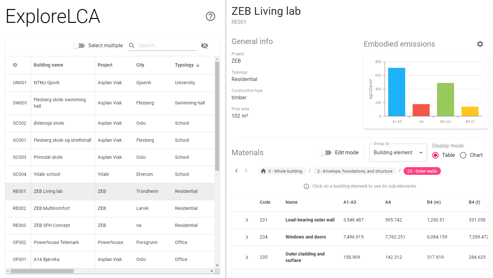

# ExploreLCA
ExploreLCA is a web application for exploring and visualising life cycle assessments of buildings found in the bLCAd tool.



## Setup
Clone the repository
```
git clone https://github.com/ericvel/explore-lca.git
```

Navigate to the *backend* directory and install dependencies for the Node server
```
cd explore-lca/backend
npm install
```

Navigate to the *client* directory and install dependencies for the React App
```
cd ../client
npm install
```

Create a copy of *.env.sample* and rename it to *.env*.  
Replace the placeholder values with values from your MySQL database and Firebase project.

Run the React App and the Node server at the same time
```
npm run dev
```
